# Sistem Arsip Surat Asrama Mahasiswa UNMUL (ASMAUL)

## Identitas Mahasiswa

- **Nama:** Condro Abril
- **NIM:** 2509116069
- **Kelas:** [Isi Kelas]
- **Mata Kuliah:** Pemrograman Berorientasi Objek

## Deskripsi Studi Kasus

Sistem Arsip Surat Asrama Mahasiswa UNMUL (ASMAUL) adalah aplikasi berbasis console atau Command Line Interface (CLI) yang dibuat menggunakan bahasa pemrograman Java.

Aplikasi ini dibuat untuk membantu proses pencatatan dan pengelolaan arsip surat di Asrama Mahasiswa Universitas Mulawarman. Sistem ini menjadi alternatif sederhana untuk menggantikan pencatatan arsip surat secara manual menggunakan Microsoft Excel.

Aplikasi ini memiliki fitur pengelolaan surat masuk dan surat keluar dengan operasi CRUD (*Create, Read, Update, Delete*).

Data surat disimpan menggunakan `ArrayList` selama program berjalan.

## Fitur Aplikasi

### 1. Pengelolaan Surat Masuk

- Menampilkan data surat masuk.
- Menambahkan data surat masuk.
- Mengedit data surat masuk.
- Menghapus data surat masuk.
- Kembali ke menu utama.

### 2. Pengelolaan Surat Keluar

- Menampilkan data surat keluar.
- Menambahkan data surat keluar.
- Mengedit data surat keluar.
- Menghapus data surat keluar.
- Kembali ke menu utama.

### 3. Menu Utama

- Memilih menu surat masuk.
- Memilih menu surat keluar.
- Keluar dari program menggunakan pilihan `0`.

## Struktur Class

Aplikasi ini memiliki beberapa class utama sebagai berikut:
`Surat`: Superclass yang menyimpan atribut umum surat 
`SuratMasuk`: Subclass untuk mengelola data surat masuk 
`SuratKeluar`: Subclass untuk mengelola data surat keluar 
`ArsipSuratAsmaul`: Class utama yang mengatur menu dan proses CRUD 

## Diagram Kelas

Diagram kelas sederhana dari aplikasi ASMAUL:

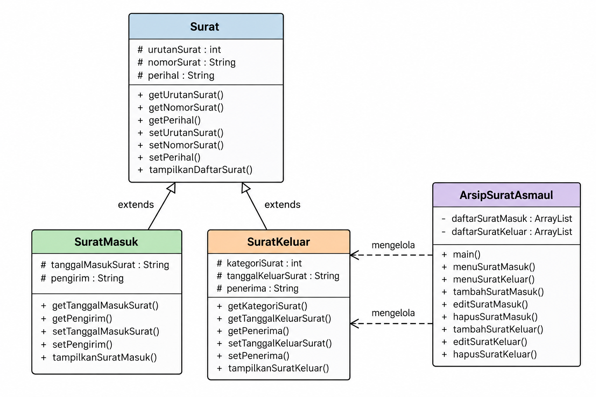

Hubungan antarclass pada aplikasi:

- `Surat` berperan sebagai superclass.
- `SuratMasuk` mewarisi class `Surat`.
- `SuratKeluar` mewarisi class `Surat`.
- `ArsipSuratAsmaul` digunakan untuk mengatur menu dan proses pengelolaan data surat.

## Penerapan Konsep Inheritance

Konsep **inheritance** diterapkan dengan membuat class `SuratMasuk` dan `SuratKeluar` sebagai turunan dari class `Surat`.

Class `Surat` berisi atribut umum yang dimiliki oleh surat, yaitu:

- Urutan surat.
- Nomor surat.
- Perihal.

Class `SuratMasuk` dan `SuratKeluar` kemudian mewarisi atribut dan method dari class `Surat`, serta memiliki atribut tambahan sesuai jenis surat.

Contoh penerapan inheritance pada class `SuratMasuk`:

```java
public class SuratMasuk extends Surat {
    protected String tanggalMasukSurat;
    protected String pengirim;

    public SuratMasuk(
        int urutanSurat,
        String nomorSurat,
        String perihal,
        String tanggalMasukSurat,
        String pengirim
    ) {
        super(urutanSurat, nomorSurat, perihal);
        this.tanggalMasukSurat = tanggalMasukSurat;
        this.pengirim = pengirim;
    }
}
```

Pada kode tersebut, kata kunci `extends` digunakan untuk menunjukkan bahwa class `SuratMasuk` mewarisi class `Surat`.

Kata kunci `super()` digunakan untuk memanggil constructor dari superclass `Surat`.

## Teknologi yang Digunakan

- Bahasa pemrograman: Java
- IDE: NetBeans
  
## Dokumentasi Screenshot Program

Berikut adalah dokumentasi proses penggunaan aplikasi ASMAUL.

> Seluruh screenshot disimpan di dalam folder `images`.

### 1. Menu Utama

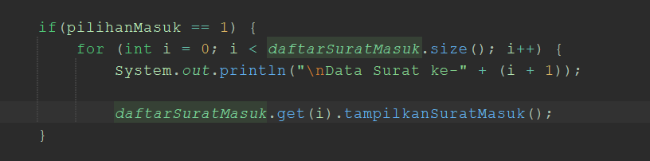

### 2. Menu Surat Masuk

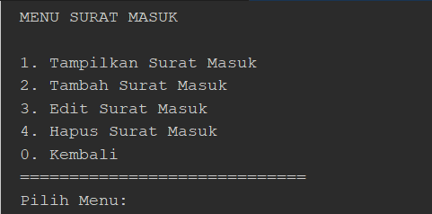

### 3. Menampilkan Surat Masuk

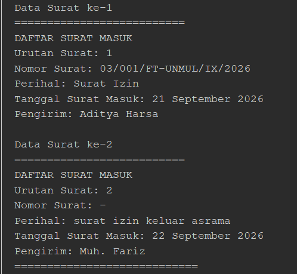

### 4. Menambahkan Surat Masuk

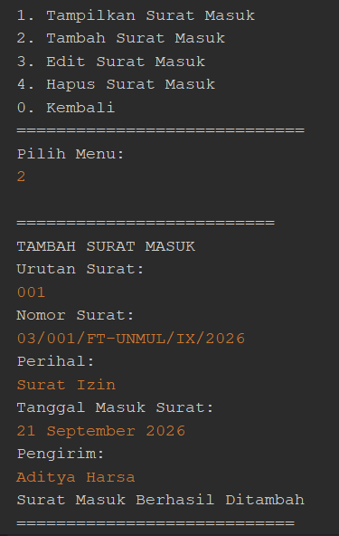

### 5. Mengedit Surat Masuk

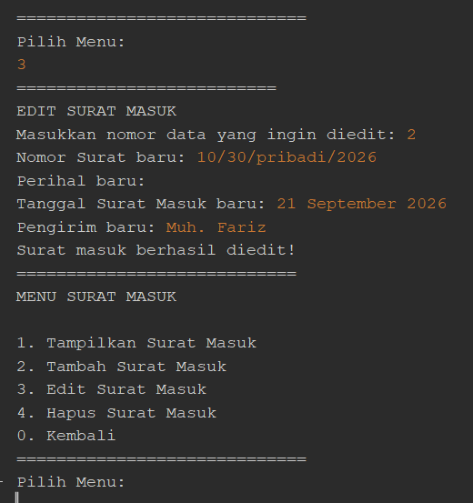

### 6. Menghapus Surat Masuk

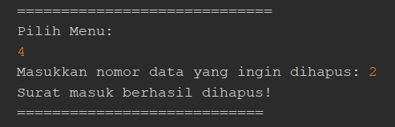

### 7. Kembali dari Menu Surat Masuk

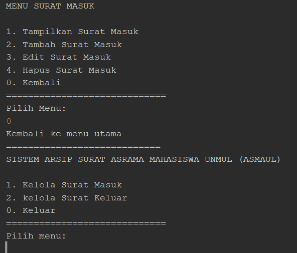

### 8. Menu Surat Keluar

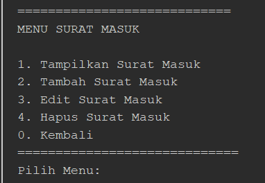

### 9. Menampilkan Surat Keluar

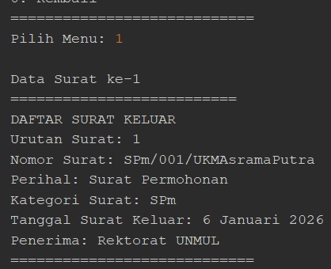

### 10. Menambahkan Surat Keluar

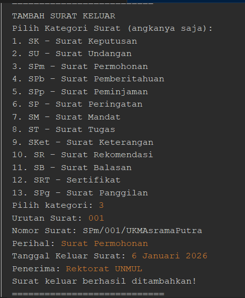

### 11. Mengedit Surat Keluar

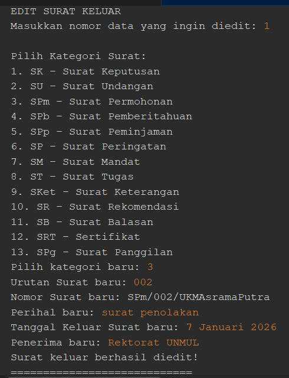

### 12. Menghapus Surat Keluar

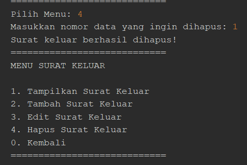

### 13. Kembali dari Menu Surat Keluar

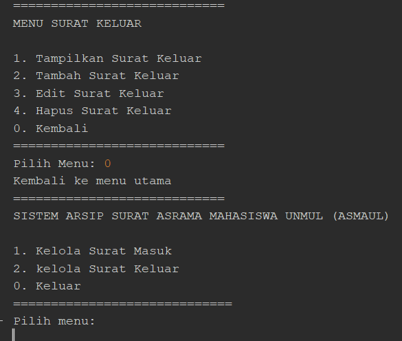

### 14. Keluar dari Program

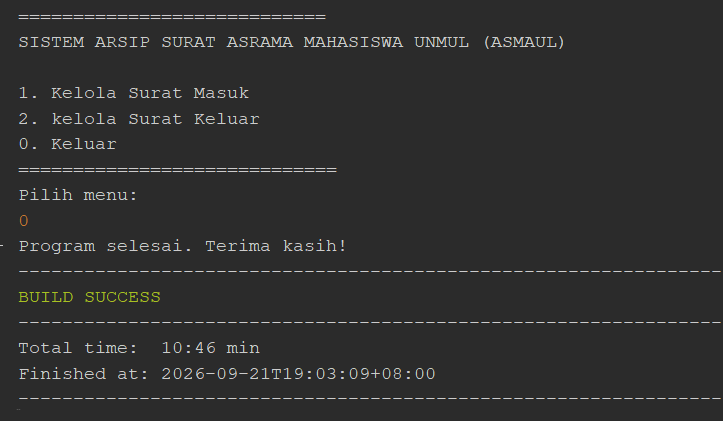

## Penutup

Sistem Arsip Surat Asrama Mahasiswa UNMUL (ASMAUL) dibuat sebagai penerapan konsep dasar Pemrograman Berorientasi Objek menggunakan bahasa Java.

