# Sistem Pengarsipan Surat Asrama Putra Universitas Mulawarman

## 1. Deskripsi Singkat Program

Program **Sistem Pengarsipan Surat Asrama Putra Universitas Mulawarman** adalah program yang dibuat untuk mengelola data surat masuk, surat keluar, dan menampilkan data penghuni asrama. Class Penghuni sendiri berfungsi untuk melihat daftar penghuni yang bisa menjadi acuan untuk membuat surat. 

Program dirancang agar dapat melakukan CRUD pada data surat masuk dan surat keluar, serta fitur Read untuk menampilkan data penghuni. Data tersebut disimpan menggunakan `ArrayList`.

## 2. Alur Program

Ketika program dijalankan, sistem terlebih dahulu membuat beberapa data dummy yang terdiri dari data surat masuk, surat keluar, dan data penghuni. Data tersebut kemudian disimpan ke dalam `ArrayList`.

Setelah itu, program menampilkan menu utama:

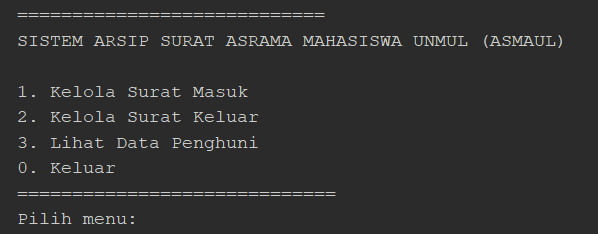

Pada gambar diatas, pengguna bisa memilih menu apa yang mau mereka akses, antara menu surat masuk, menu surat keluar, atau menu data penghuni. Pengguna bisa memilih menu tersebut dengan menginput nomor menu yang tersedia. Apablia angka menu tidak tersedia, maka program langsung menyatakan bahwa, inputan menu tidak valid. 

### Kelola Surat Masuk

Pada menu Surat Masuk, pengguna dapat melakukan:

- Menampilkan surat masuk
- Menambahkan surat masuk
- Mengedit surat masuk
- Menghapus surat masuk

### Kelola Surat Keluar

Pada menu Surat Keluar, pengguna dapat melakukan:

- Menampilkan surat keluar
- Menambahkan surat keluar
- Mengedit surat keluar
- Menghapus surat keluar

Pada saat menambahkan surat keluar, pengguna akan memilih kategori surat. Sistem kemudian membuat nomor surat secara otomatis berdasarkan kategori, nomor urut, nama organisasi, dan tahun.

**Daftar Kategori Surat**

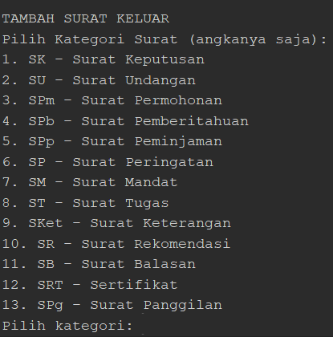

**Contoh Nomor surat yang dihasilkan:**

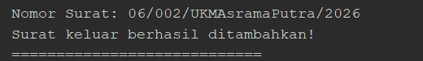

pada contoh diatas, surat keluar berarti memiliki kategori 6 yaitu surat peringatan, dengan urutan 2 dan tahun keluar 2026.

### Lihat Data Penghuni
Pada menu Data Penghuni, pengguna dapat melihat data penghuni yang telah disediakan sebagai data dummy.

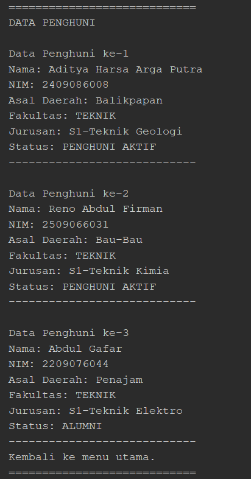

## 3. Penerapan Encapsulation

Encapsulation diterapkan pada class `Surat`, `SuratMasuk`, `SuratKeluar`, dan `Penghuni` dengan membatasi akses terhadap atribut serta menyediakan method **getter dan setter**.

Pada class `Penghuni`, atribut dibuat menggunakan access modifier `private`:

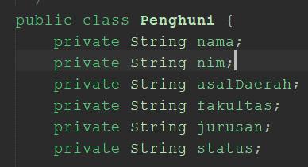

Akses untuk mengambil nilai atribut dilakukan melalui getter. Contohnya:

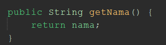

Sedangkan untuk mengubah nilai atribut digunakan setter:

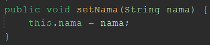

Getter dan setter juga digunakan pada proses pengelolaan data surat. Contohnya pada proses edit surat:

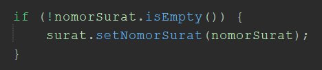

Dengan penerapan encapsulation, atribut pada object tidak diubah secara langsung dari luar class, tetapi melalui method getter dan setter yang telah disediakan.

## 4. Penerapan Inheritance

Inheritance diterapkan dengan menggunakan class `Surat` sebagai **superclass**, kemudian diturunkan menjadi dua subclass, yaitu `SuratMasuk` dan `SuratKeluar`.

Class `Surat` memiliki variabel  yang digunakan oleh kedua jenis surat sehingga `Surat` menjadi Superclass karena variabelnya digunakan di kedua `SuratMasuk` dan `SuratKeluar`:

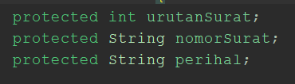

Kemudian, Class `SuratMasuk` sebagai subclass mewarisi class `Surat`:

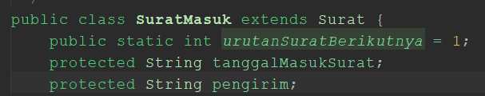

terlihat pada gambar, `SuratMasuk` memiliki variabel unik berupa tanggal surat masuk, dan pengirim.

class `SuratKeluar` juga sebagai subclass dari `Surat` mewarisi class `Surat`:

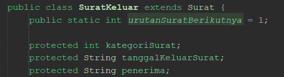

terlihat pada gambar, `SuratKeluar` memilik variabel unik berupa tanggal surat keluar, kategori surat, dan penerima.

Dengan inheritance, variabel dan method yang digunakan di kedua jenis surat, yaitu surat masuk dan keluar, dideklarasikan pada class `Surat` dan dapat digunakan oleh `SuratMasuk` dan `SuratKeluar`, sehingga tidak perlu membuat variabel dan method yang sama kembali pada setiap subclass.

## 5. Polymorphism

Nilai tambah yang diterapkan pada program adalah **polymorphism menggunakan method overriding**.

Polymorphism diterapkan pada method `tampilkanDaftarSurat()` Pada class `Surat`.

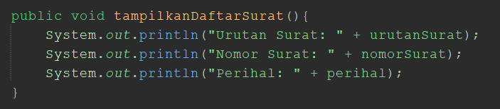

Method tersebut kemudian dioverride pada class `SuratMasuk`:

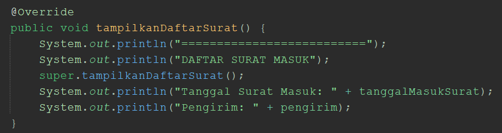

Method yang sama juga dioverride pada class `SuratKeluar`:

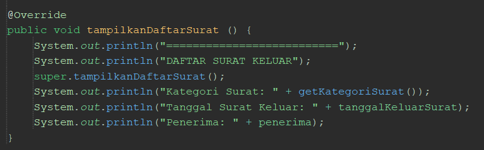

Penggunaan `@Override` menunjukkan bahwa method `tampilkanDaftarSurat()` pada subclass menggunakan method dengan nama dan parameter yang sama dari superclass, tetapi memiliki tambahan sesuai dengan jenis surat.
